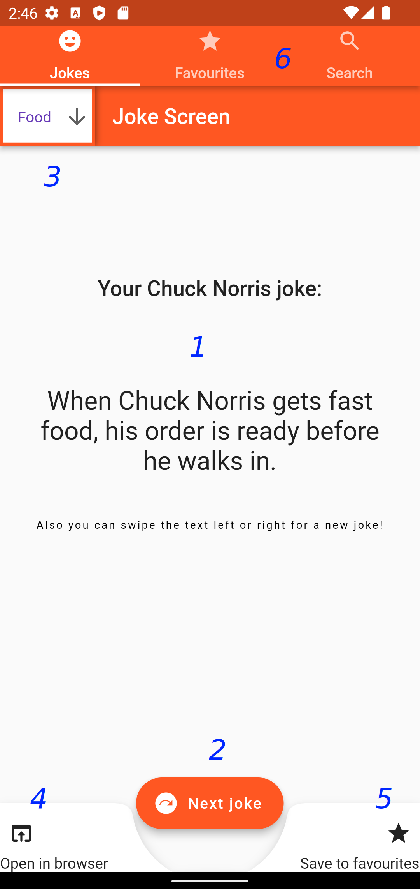
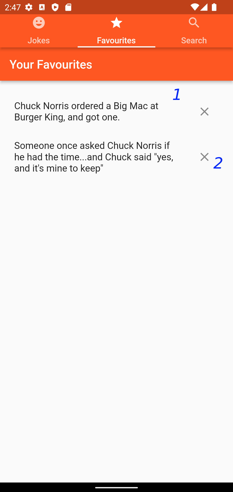
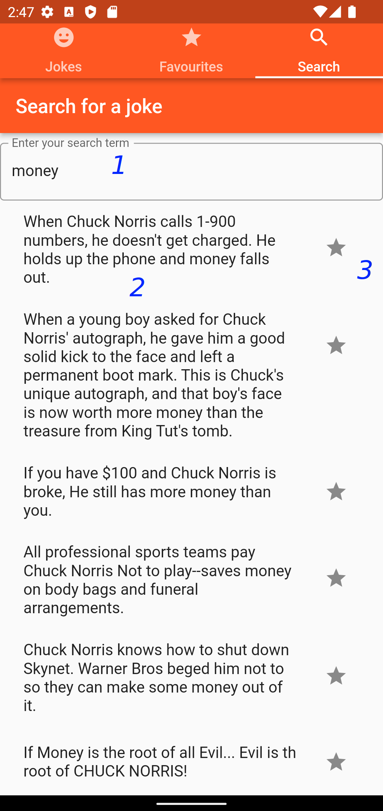

# homeworks_cpmdwithf

Flutter project for assignments from CPMDWithF course

## Getting Started

This is the project for the Homework Assignment of the CPMDWithF course.

This project features the implementation of Tinder with Chuck! 2.0. This is a Tinder-like application which presents a user with a joke related to Chuck Norris. All joke are taken from [chucknorris.io](https://chucknorris.io/). 

## App structure

The main source code of the app is located in the `lib` folder. The code is written in Flutter (dart). Each screen of the app is located in separate source file (e.g. `Jokes Screen` is located in `lib/jokes.dart`). UI structure of each screen is completely defined within its respective `.dart` file, while app functionality and logic is defined in separate files located in `models` directory (e.g. functionality of the `Jokes Screen` is located in `lib/models/joke_model.dart`). `lib/assets` directory contains the icon of the app.

## How to use

This app is divided into several screens, each with its own functionality. The first screen of the app is the `Jokes Screen`.

`Jokes Screen` alows a user to get a random joke from [chucknorris.io](https://chucknorris.io/). The retrived joke will appear in the field (1). To get a new joke, the user can either swipe the text in the field (1) to left or right, or they can click `Next joke` button in the field (2). User can specify the category of the joke to retrieve from dropdown menu in the field (3). To open the joke in the external browser the user can click `Open in browser` button in the field (4). If the user liked the current joke, they save it on device to their favourites using `Save to favourites` button in the field (5). If the joke is already present in the favourites list, then instead the joke  will be removed from the list. In either case, the user will notified that the joke was added or removed with a little message appearing at the bottom of the screen. To get to the other screens of the app, user can interact with the buttons on the top of the screen in the field (6).

Next screen is the `Favourites Screen`.

`Favourites Screen` displays all previously saved jokes in a scrollable list in field (1). Each joke can be removed from this list by clicking on the `X` button. For example, as shown in the field (2). If the list is empty, the screen will notify the user that they did not favourite any jokes yet.

Final screen of the app is `Search Screen`.

`Search Screen` allows the user to query for specific joke from [chucknorris.io](https://chucknorris.io/). User can type their query in the text input area in the field (1). After they submit a query, the list below will be filled with matching results, like in the field (2). After that, the user can save or remove each joke to or from their favourites list, by clicking the star-shapped buton in the field (3). This is the similar functionality as in the `Save to favourites` button in the `Jokes Screen`.
